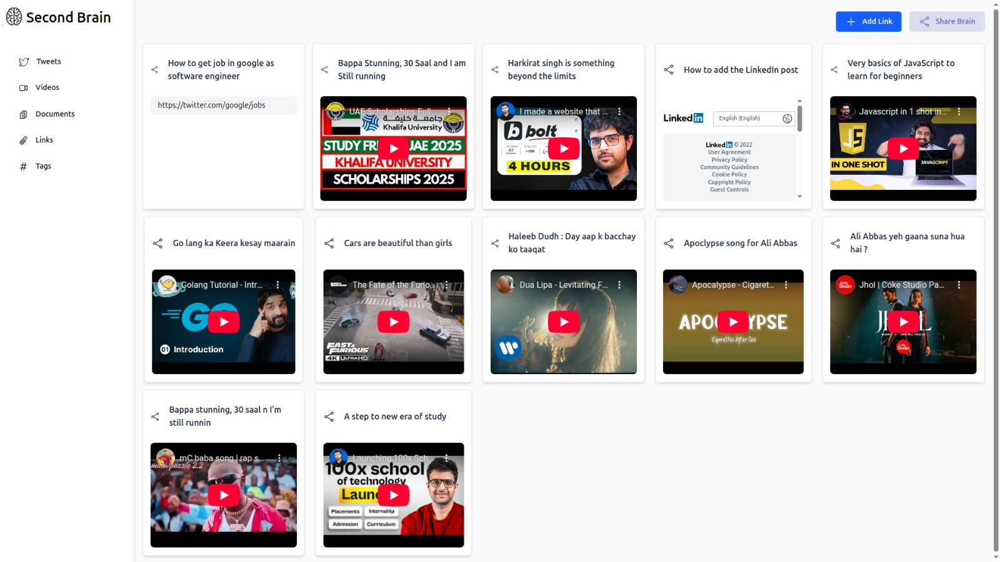

# Brainly - Content Organization Platform

Brainly is a full-stack application that helps users organize and manage content from various sources.

## Screenshots

### Sign Up Page


### Sign In Page


## Dashboard



## Tech Stack

- **Frontend**: React with TypeScript, Vite, Tailwind CSS
- **Backend**: Express.js, TypeScript, Mongoose
- **Database**: MongoDB
- **Runtime**: Bun

## Project Structure

The project is divided into two main parts:

### Backend (Brainly-BE)

- RESTful API with Express.js
- MongoDB integration with Mongoose
- JWT authentication
- Content management routes

### Frontend (Brainly-FE)

- React with TypeScript
- Vite for build tooling
- Tailwind CSS for styling

## Features

- **User Authentication**: Sign up and sign in functionality
- **Content Management**:
  - Create and read the links
- **Brain Sharing**: Share organized content collections with others

## API Endpoints

### User Routes

- `POST /api/v1/user/signup` - Register a new user
- `POST /api/v1/user/signin` - Authenticate a user

### Content Routes

- `POST /api/v1/content` - Create new content
- `GET /api/v1/content` - Retrieve all content for a user
- `DELETE /api/v1/content` - Delete specific content

### Brain Routes

- `POST /api/v1/brain/share` - Share a brain collection
- `GET /api/v1/brain/:shareLink` - Access a shared brain collection

## Getting Started

### Backend Setup

```bash
cd Brainly-BE
bun install
# Create a .env file with DB_URL and JWT_SECRET
bun run dev
```

### Frontend Setup

```bash
cd Brainly-FE
bun install
bun run dev
```

## Authentication

The application uses JWT tokens for authentication. Include the token in the Authorization header for protected routes.
